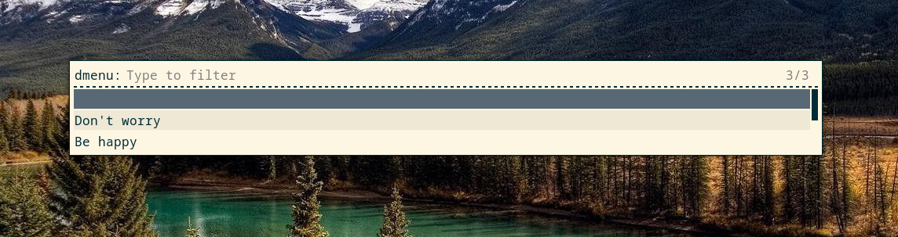
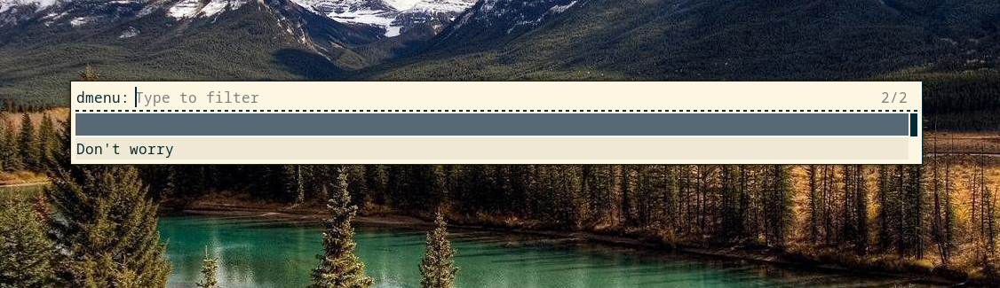
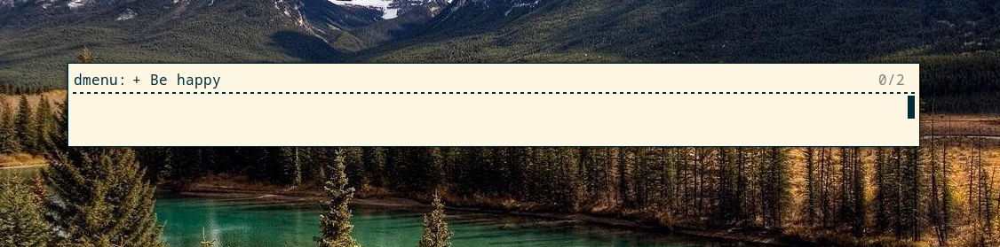
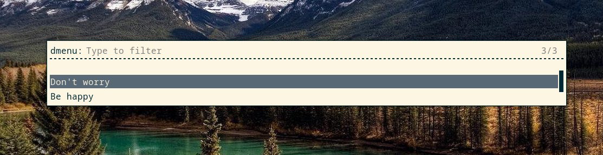
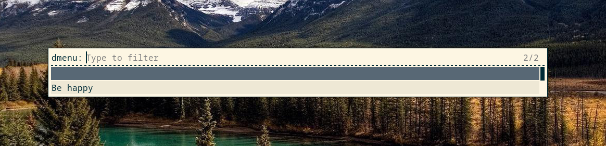

# rust_todolist - Rust TodoList

The goal of this project is to learn the Rust programming language and file management with the language.

Tested on Arch Linux only.

The program use Rofi through the [rofi crate](https://crates.io/crates/rofi):

```
[dependencies]
rofi = "0.3.0"
shellexpand = "2.1.0"
```

## Installation

```
git clone https://github.com/reverseth/rust_todolist.git
cd rust_todolist
cargo build --release
cp target/release/rust_todolist ~/.local/bin/
```

### To run from CLI

```
$ rust_todolist
```

### To run from i3 shortcut

Here we bind the program on the i3's Super+t shortcut:

```
echo -n "bindsym $mod+t exec rust_todolist" >> .config/i3/config
```

### To run from polybar

Add this module (can be customised) in your polybar config file:

```
[module/todolist]

type = custom/text
click-left = ~/.local/bin/rust_todolist

content = "  "

```

## How to use

```
$ rust_todolist
```

### Display task

Simply launch the program.

[]

### Add task to the Todo List

Lauch the program, and prefix your task with "+".

[]

[]

[]

### Remove task to the Todo List

Lauch the program, select the task, press Enter.

[]

[]
